# ultrasonic-holography

Levitation of styrofoam beads, modulated music playing, and haptic feedback using our custom ultrasonic board.

This project features a 10-layer PCB with 16x16 transducers, 2 Intel Cyclone FPGAs, the HAT phase solver implemented in Rust, and position control
software written in Rust/Python. 


# 1. Hardware Setup

## Assembly


## Transducer Polarity Test

The polarity marked on the bottom of the transducers are often unreliable. Instead, test for the polarity and ensure that the polarity is consistent. This reduces the amount of calibration required in the next step.

### Simple Transducer Polarity Test

Equipment:
- Multimeter

Instructions
- Set the multimeter to voltage mode at 100mV.
- Touch the negative probe of the multimeter to the unmarked leg of a transducer. Then, touch the positive probe to the marked leg.
- The voltage reading should temporarily spike either to a positive or negative value.
- If the voltage is positive, the marked leg is the positive input. Otherwise, the marked leg is the negative input.

## Calibration

Due to wide manufacturing tolerances, there is a lot of variability between each transducer. We have built in a calibration function in our hardware layer. See: [Function](https://www.github.com/ultrasonic-homies/ultrasonic-holography/blob/6c5b075/rust_rev1/src/fpga.rs#L188) or in repo
[Function](rust_rev1/src/fpga.rs#L188)

### Suggested Calibration Instructions

Prerequisites

- Rev 1 board is working

Equipment

- 2-Channel Oscilloscope
- Spare transducer

Instructions

- Have Rev 1 up and running
- Probe both legs of a spare transducer on one oscilloscope channel
- Probe the "SYNC" breakout point on the other channel and use this as the trigger
- Run test script
```bash
cd fpga/tests/phase_calibration
cargo run
```
- Place the spare transducer directly in front of transducer 0 on the board (top left corner with respect to PCB logo)
- Use test script command line interface to adjust the phase
- Once you exit the script, the calibration values will be printed. Each transducer has a calibration with a value between 0 and 255.
- Copy and paste this array into `PHASE_CALIBRATION` in `rust_rev1/board.rs`
- Now, calling `set_preset_calibration()` followed by `calibrate()` will save the calibration into hardware. (See `/rust_rev1/board.rs`)

## Generating Quartus Project

The Quartus project (including `.qpf` file) is configured in the `.tcl` file, and is generated with the shell script `create_proj.sh`

```bash
cd ultrasonic_holography/fpga/<your fpga>
./create_proj.sh
```

To clean the repository of Quartus project files, run `clean.sh`

```bash
cd ultrasonic_holography/fpga/<your fpga>
./clean.sh
```

## Changing Pin Assignments

We use the "Import Assignments" feature to assign our pins. Specifically, we import from `.qsf` files, which use the `TCL` language to specify pin assignments. To change pin assignments:

- Remove the existing pin assignments
    - Assignments -> Remove Assignments
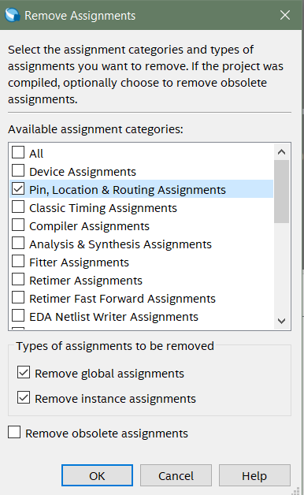
- Import the assignments from your `.qsf` file.
    - Assignments -> Import Assignments
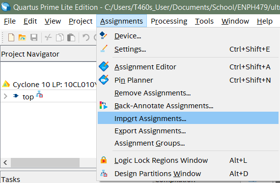

### Generating `.qsf` Pinout Files
We created a script that converts the Altium CSV pinouts to a `.qsf` file that can be imported to Quartus.

Instructions
- Place your CSV file in the `\fpga\scripts\` folder
- Ensure that the net conversion is configured correctly in `net_name_map.py`
- Ensure that the input and output paths are configured correctly in `altium_csv_to_qsf.py`
- Run the following:
```bash
cd fpga/scripts
python altium_csv_to_qsf.py
```
## Compiling Quartus Project

These steps are essential to compiling your Quartus project.

- Correct header file is included in [top.sv](/fpga/shared/top.sv#L27)
- Pins are assigned
- Files are included in your project
    - Project -> "Add/Remove Files in Project..."
    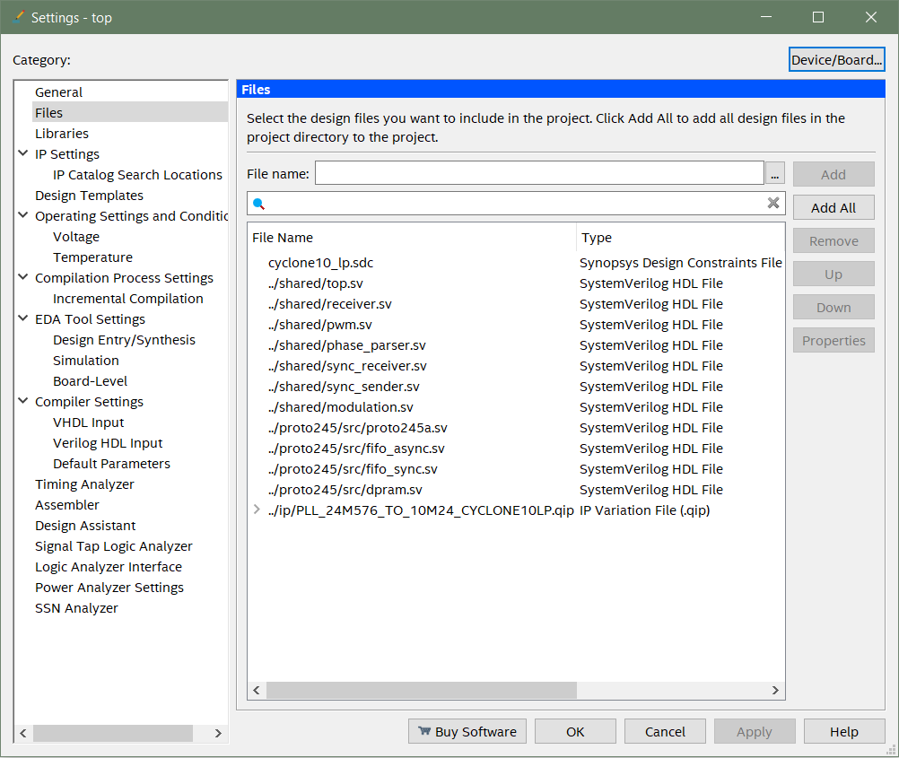

Once compiled, you will obtain a `.sof` configuration file in your `output_files` folder.

## Programming FPGA

The FPGA does not have persistent memory on its own. You can either program it each time on stastup, or use a configuration device, like the EPCQ16A, to load the program onto the FPGA on power-up.

### One-time Program

Equipment
- USB Blaster Cable
- PC with `.sof` file

Instructions
- Attach the Blaster cable to the PC
- With the Rev 1 Board powered down, attach the Blaster cable to the Primary JTAG header
- Power on the Rev 1 Board
- In the Quartus Programmer (Tools -> Programmer):
    - Select the USB Blaster in Hardware Setup
    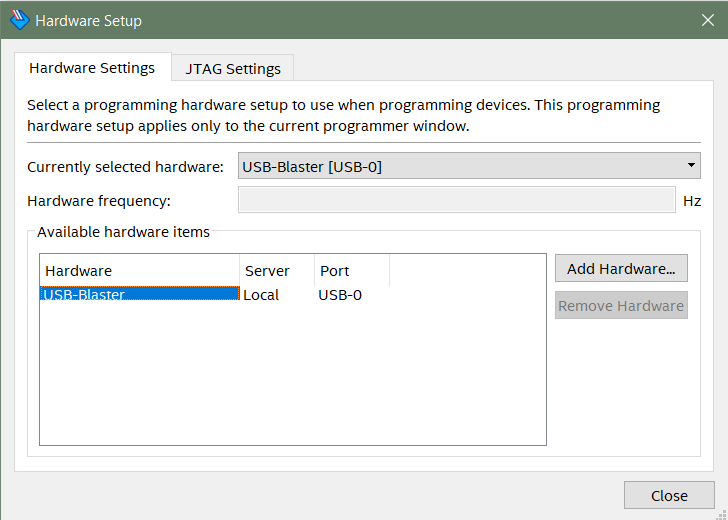
    - Delete all existing files loaded into the Programmer
    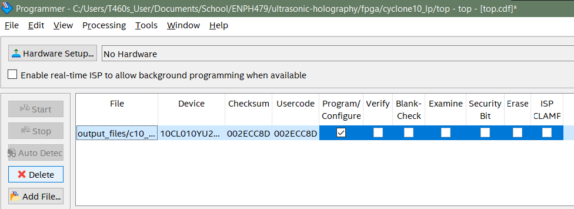
    - Add your `.sof` file
    - Check the Program/Configure box
    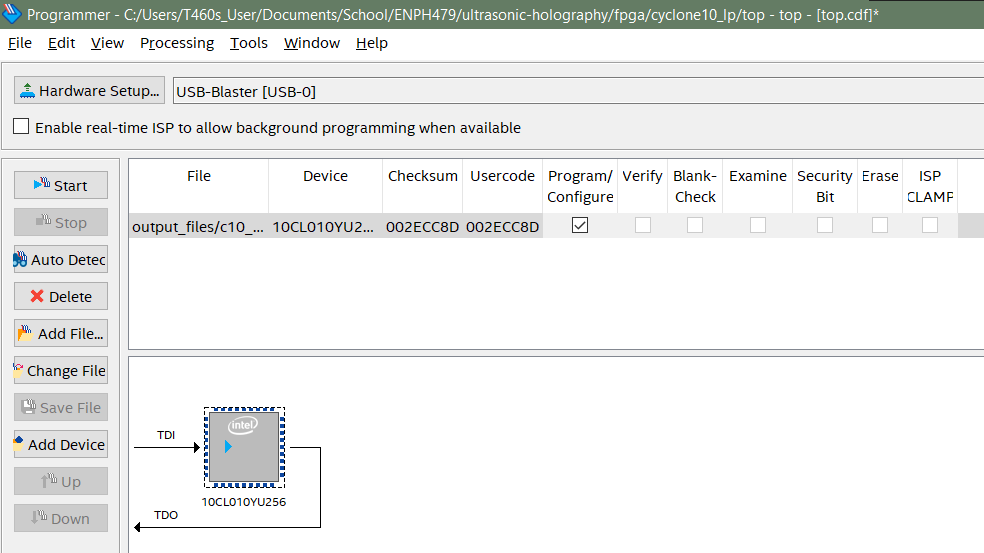
    - Click Start

### Persistent Program

Equipment
- USB Blaster Cable
    - Ensure that you have a Terasic or Quartus official Blaster cable!
- PC with `.sof` file

Instructions

- Go to File -> "Convert Programming Files..."
    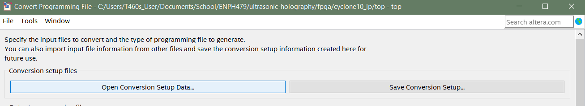
- Click "Open Conversion Setup Data..." and locate [`/fpga/cyclone10_lp/jic_conversion_setup.cof`](/fpga/cyclone10_lp/jic_conversion_setup.cof)
    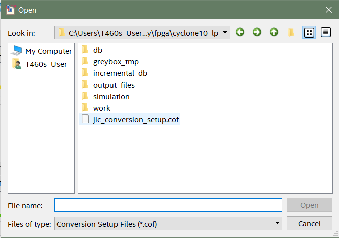
- Check that the correct `.sof` program is specified
    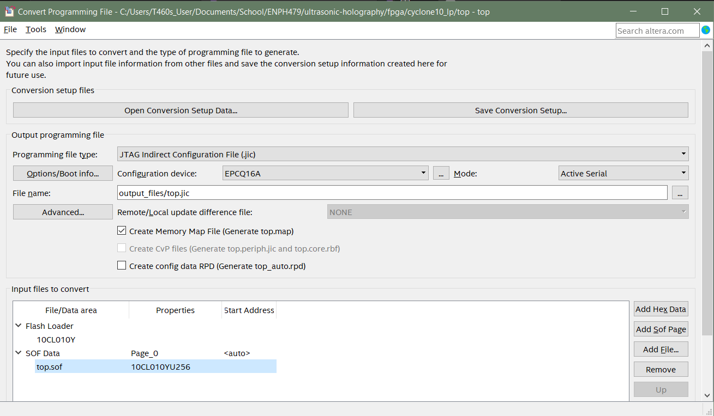
- Click "Generate", which should generate a `.jic` file in your `output_files` folder
- Attach the Blaster cable to the PC
- With the Rev 1 Board powered down, attach the Blaster cable to the Primary JTAG header
- Power on the Rev 1 Board
- In the Quartus Programmer (Tools -> Programmer):
    - Select the USB Blaster in Hardware Setup
    
    - Delete all existing files loaded into the Programmer
    
    - Add your `.sof` file
    - Check the Program/Configure box
    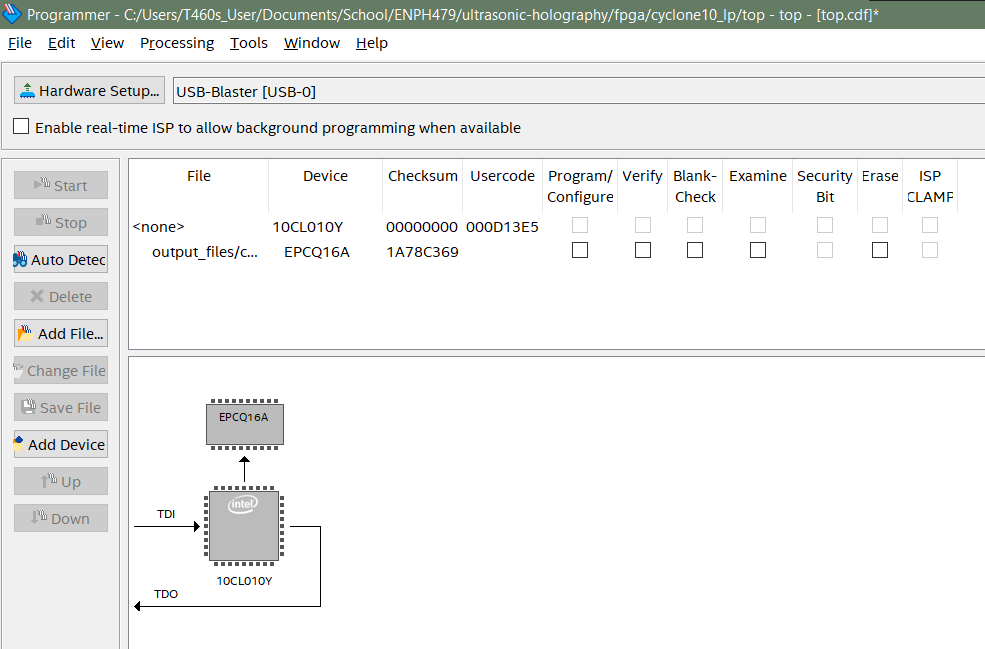
    - Click Start

## First Time FT2232H Setup

The FT2232H by default is a USB to UART device. However, it can be configured by an EEPROM device on power-on to be an FT245 protocol device, which is required for the operation of the Rev 1 Board. The FTDI company provides utilities to program the EEPROM through USB. Due to the persistent nature of the EEPROM, this only needs to be done once.

Equipment
- Functioning Rev 1 Board
- PC and USB Cable

Instructions

- Download FT_Prog EEPROM utility by FTDI [here](https://ftdichip.com/utilities/)
- Connect FT2232H device to PC via USB, ensuring that VCCIO pins are powered
- Load the template in [`ft2232h\ft_prog_dual_fifo.xml`](ft2232h\ft_prog_dual_fifo.xml)
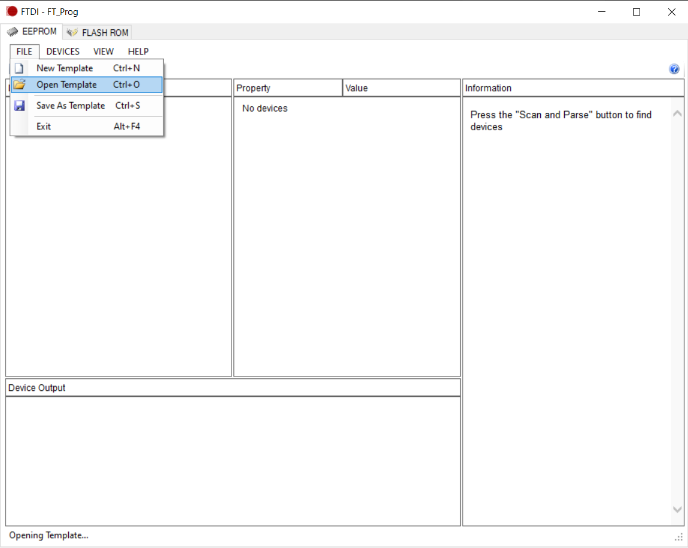
- Scan and parse for the device.
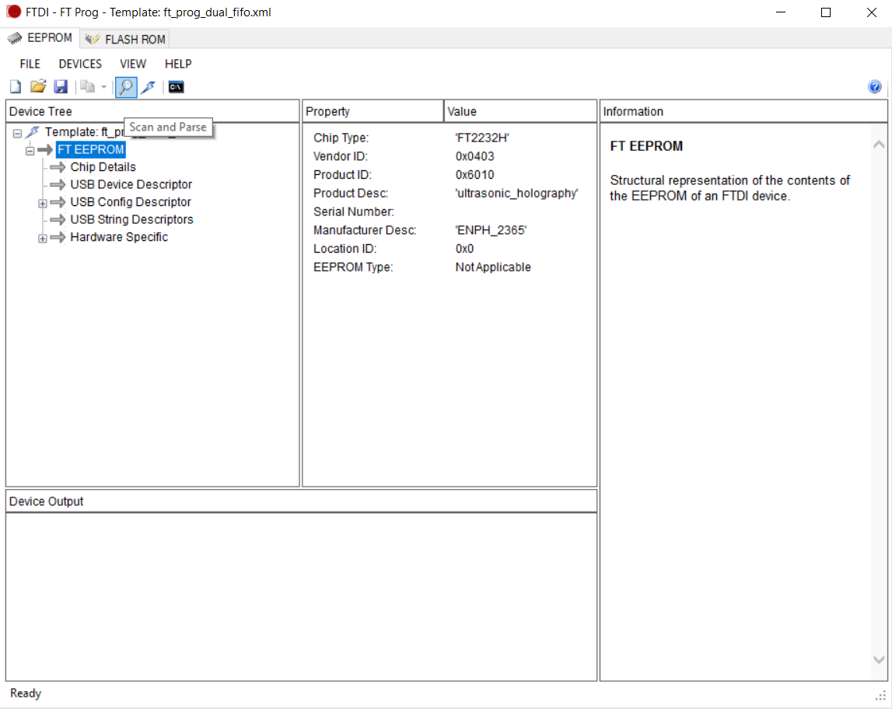
- The device should appear in the Device Tree. Note the EEPROM type.
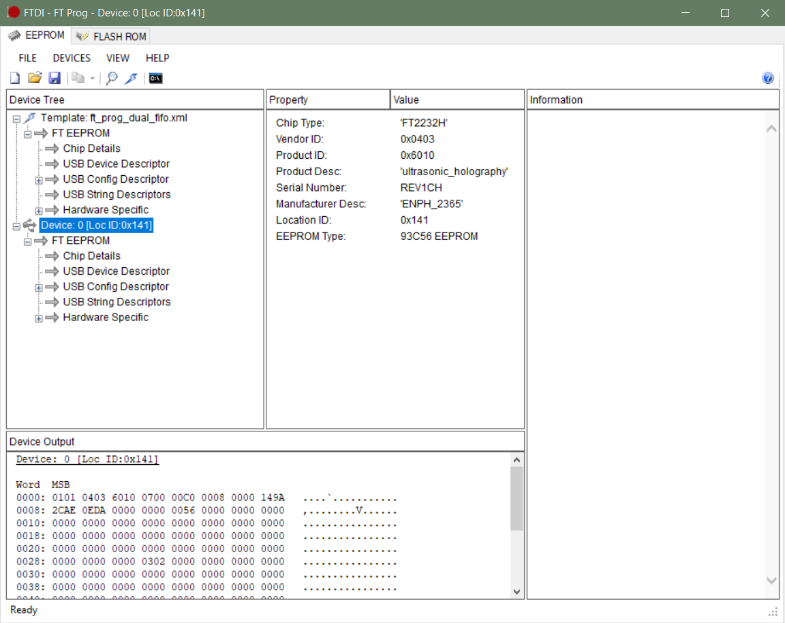
- Right-click the device and apply the template
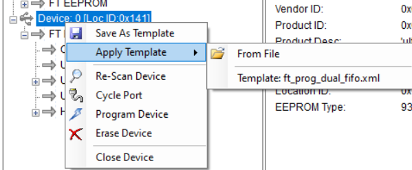
- Program the device using the button with the lightning icon

Now, you have written the configuration into EEPROM and the FT2232H should be configured correctly on power-up.

### Explanation of Template
USB Config Descriptor -> USB Powered
- Device is powered through USB port. Either is possible with the FT2232H though.

Hardware Specific -> Port A/B -> Hardware -> 245 FIFO
- Parallel FIFO mode. FT2232H supports async dual channel, but only sync for channel A.

Hardware Specific -> Port A/B -> Driver -> D2XX Direct
- Use D2XX driver with its C DLL instead of the COM port. This is necessary for synchronous mode, but optional for async. D2XX has wrappers in Python and Rust.

# 2. Software Setup
To fully run our system, you need Rust, Python and Blender installed. To run a less complex (and possibly faster) version of our system, you only need Rust. The versions we used were Python 3.9.13 and Rust 1.74.0, but we shouldn't have any packages that depend on these specific versions.

Python dependencies are in `requirements.txt` and Rust dependencies are in `rust_sonic_surface/Cargo.toml`.

Dockerizing more things was considered, but Blender can't show itself from within Docker and accessing USB ports from within Docker is also a possible challenge.

## Levitation
Diagram of the software pipeline:
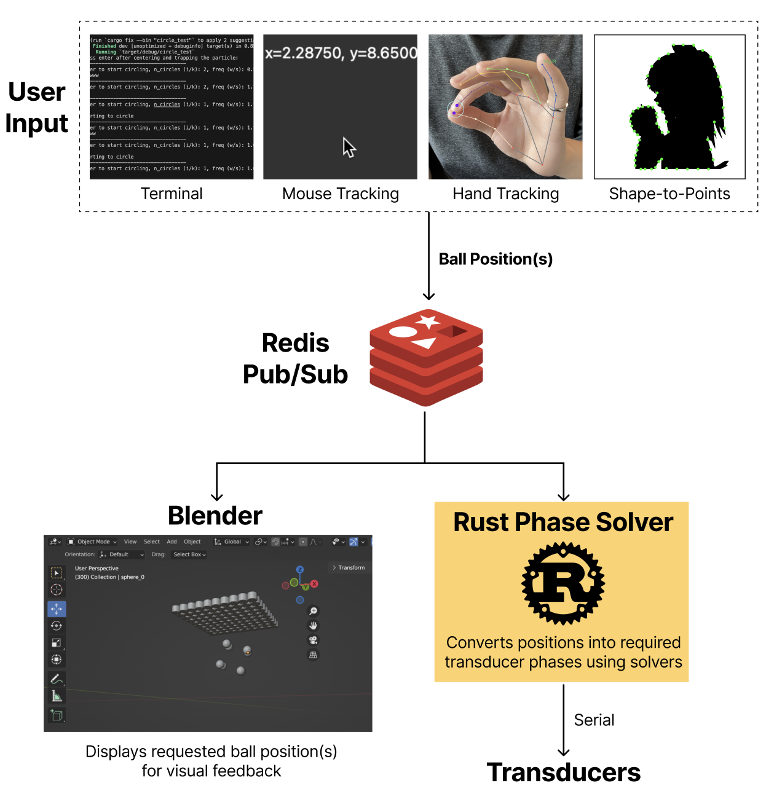

To summarize, there are a few methods for controlling the position of particles. The position information is published over Redis pub/sub to Blender for visualization and to the Rust solver to send to a board. 

### Redis
First, run Redis using one of these methods:

Using Docker:

`docker run -d --name redis-stack-server -p 6379:6379 redis/redis-stack-server:latest`

Without Docker:

If on Linux or MacOS, you can just install Redis on the command line and run it, and if on Windows, you can use WSL to run Redis or use Memurai, a Redis clone for Windows. Docker is easier to setup if you already have Docker, but it may too many resources on low-end computers.


### Rust phase solver
To send to the Sonic Surface board (connected by USB), we cd into `rust_sonic_surface` and run `cargo run --release --bin redis_positions_to_serial`. This works because redis_positions_to_serial is added in `rust_sonic_surface/Cargo.toml` as a binary. The release flag makes everything run faster.

To send to the Rev 1 board (also connected by USB, although we had to use USB-C to USB-A to USB-C, USB-C direct was not working), we cd into `rust_sonic_surface` and run `cargo run --release --bin redis_positions_to_ftdi`.


### Blender
To visualize in Blender, we run Blender (tip: run Blender from the command line so that you can stop scripts with Ctrl + C) and open `blender_sim/main.blend`. Go to the scripting tab. If running on sonic surface, set the boolean to be True and for rev 1, False. This just affects how many transducers are shown and their spacing. Click the play button:

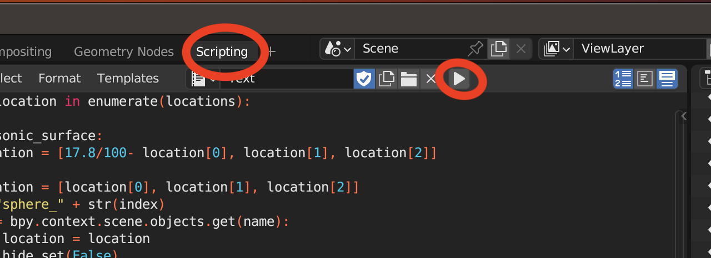


This will listen on the Redis pub sub channel and update the positions of particles in the Blender simulation. To kill the listening, send Ctrl + C into the terminal where Blender is running. 


### Position sending
Lastly, we need some method of sending positions to Redis, which will send to Blender and the Rust phase solver.

#### Python options:
Run any of these with `python script_name.py`

`position_control/all_control.py` - Mode switching GUI. M for mouse control (scroll for Z movement, works best when not lifting from near the ground), L for linear oscillation, C for circular oscillation, R for random points in 2d space. This is the easiest way to demo the project.

`position_control/hand.py` - Control position with MediaPipe hand pose tracking. Was abandoned because it was a bit too jumpy, but it should still be ready to use to publish to Redis

`position_control/keyboard_control` and - Similar to mouse control, but controlled using the arrow keys. This is helpful for sending one position at a time for debugging (can also use `send_one_position.py`).

`position_control/mouse_control` - Mouse motion, superceded by all_control.py

#### Rust options:
Cd into `rust_sonic_surface` and run any of these with `cargo run --release --bin name` (no .rs at the end, see Cargo.toml)

`circle_test` - move in a circle, adjust number of circles and speed using terminal.

`line_test` - similar to circle_test but in a line

`square_test.rs` - move four points in a circle, was a bit unstable

`cube_test.rs` - move eight points of a cube and rotate them, has a loading sequence where you add the ball to the center and it gets moved, maybe this is bad idea though. Rev 1 at high ball heights was too unstable for cube test to work


## Levitation without Blender and Redis
We can define positions directly in Rust, solve, and send directly to the board. This skips Redis and so should be faster in theory, and it also means less setup. 

To run these, just cd into `rust_sonic_surface` and run

`cargo run --release --bin <name>` for one of `line_test_no_redis`, `square_test_no_redis`, or `circle_test_no_redis`


## Haptic feedback

Haptic feedback was achieved by just running one of the mouse control setups and setting the height to around 2.5cm. It worked on Sonic Surface, but it was much stronger on the rev 1 board. The best results were when the hand was placed palm-up on the ground under the board. Moving the mouse resulted in a slight tingly/static-y feeling for the hand.

On the rev 1 board, the haptic feedback gets even stronger if you modulate the ultrasound to turn on and off at a lower frequency (e.g. 200 Hz).
This is done by setting the `haptic_feedback` boolean to true at the top of `redis_positions_to_ftdi.rs`. In summary, that script with the boolean set to true + one of the python scripts that lets you move the trap with the mouse = strongest haptic feedback.


## Playing music (Rev 1 board only)
Music can be played from a midi format by modulating the ultrasound to a lower frequency. This was done by essentially doing PWM on the 40 khz signal, but there are other ways of doing this that might work better.  Currently the board can only play two notes at a time, and we've chosen to use that to play 1 high note and one low note at a time, separated by middle c (see rust_rev1/src/board.rs)

To play music:

1. Download the midi file to the `music` folder
2. Run Redis as described previously
3. In one terminal, cd into `rust_sonic_surface` and run `cargo run --release --bin play_midi`. This listens for redis messages.
4. Edit the file variable in `music/play_midi.py` to be your midi file's name.
4. In another terminal run `python music/play_midi.py`. This sends notes over Redis to the rust script to play on the board. 


## Bad Apple

Some work was put in to try and get the board to play Bad Apple using a bead. We didn't end up doing it, but the work is documented in [bad_apple/README.md](bad_apple/README.md)

## Solvers
The solver code is in `rust_sonic_surface/src/hat`. There is `hat.rs` which we primarily used, `hat_runner.rs` that uses multithreading to calculate faster but we didn't use because were sending positions live and didn't want to implement some sort of delay/buffer, and `gorkov.rs` which didn't seem to levitate properly. HAT stands for Halographic Acoustic Tweezers, which is the name of the paper the algorithm was taken from. You can see how the solvers are used in any of the Rust files that send to the board, e.g. `redis_positions_to_ftdi.rs`.

## Possible software improvements

- Figure out the optimal spacings in space and time for smooth but fast motion
- Modulate the drivers while doing trap motion to make haptic feedback more noticeable
- Use a 3D camera and implement the Bunny paper feature of being able to levitate even when disturbances are in the acoustic field
- Use a 3d camera to control the position of the particle using your hand/a wand. 
- Experiment more with trapping multiple particles - do we need multiple traps per particle?
