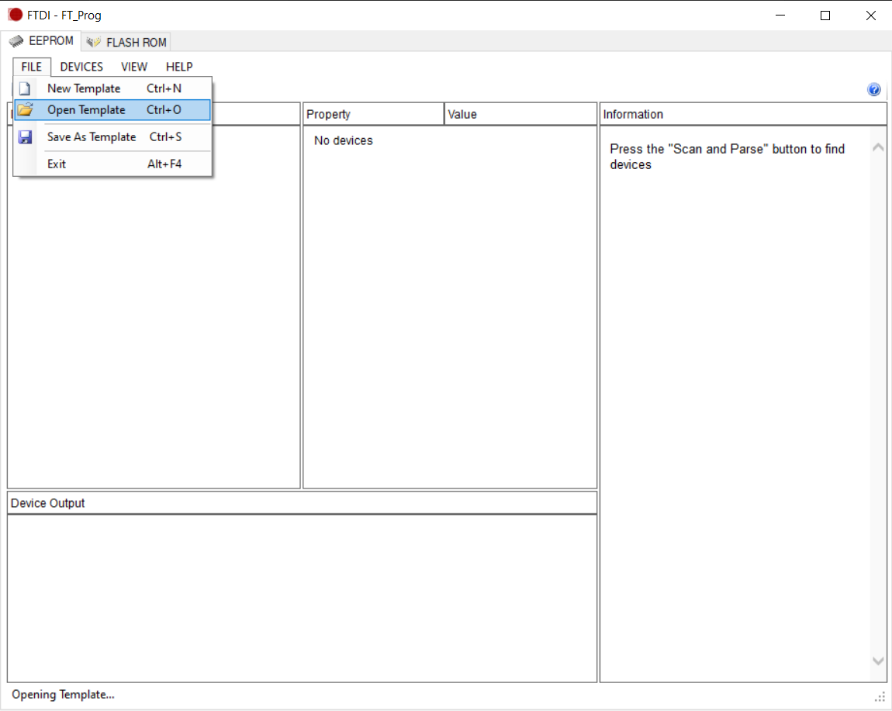
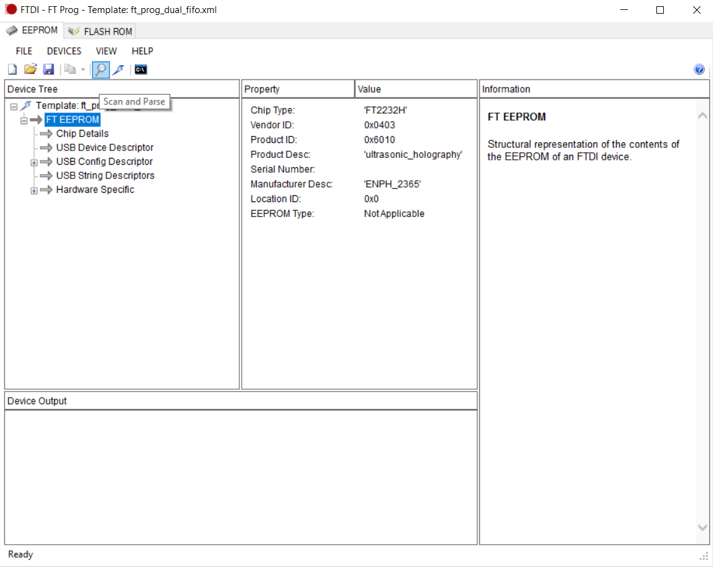
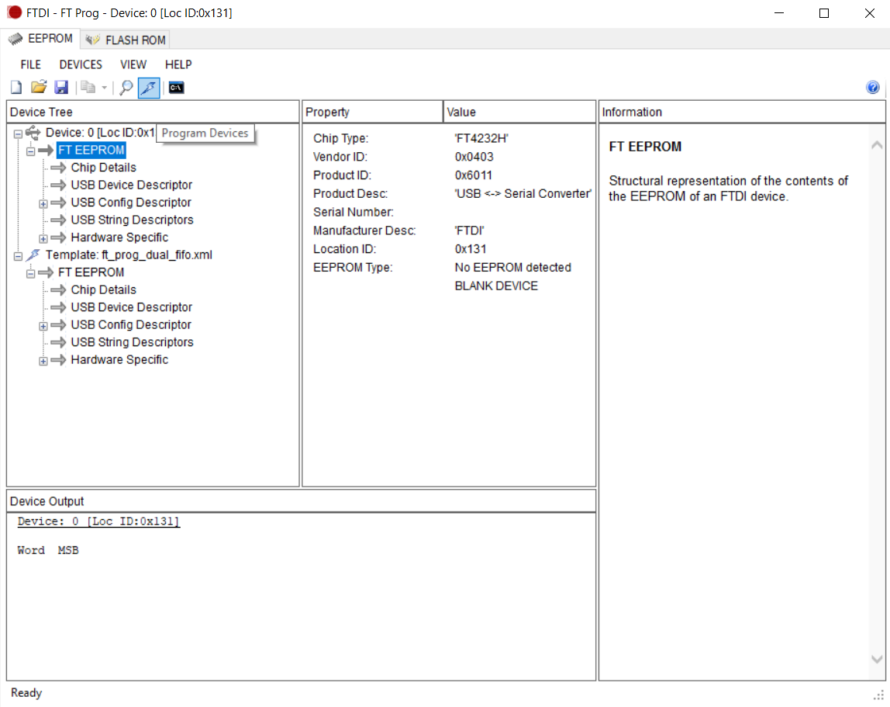

# FT2232H

## Configuration

Steps to configure device:
1. Download FT_Prog EEPROM utility by FTDI [here](https://ftdichip.com/utilities/)
2. Load the template named `ft_prog_dual_fifo.xml`

3. Connect FT2232H device to PC via USB, ensuring that VCCIO pins are powered
4. Scan and parse for the device

5. Ensure that the device appears in the Device Tree
6. Program the device

## Explanation of Template

USB Config Descriptor -> USB Powered
- Device is powered through USB port. Either is possible with the FT2232H though.

Hardware Specific -> Port A/B -> Hardware -> 245 FIFO
- Parallel FIFO mode. FT2232H supports async dual channel, but only sync for channel A.

Hardware Specific -> Port A/B -> Driver -> D2XX Direct
- Use D2XX driver with its C DLL instead of the COM port. This is necessary for synchronous mode, but optional for async. D2XX has wrappers in Python and Rust.

